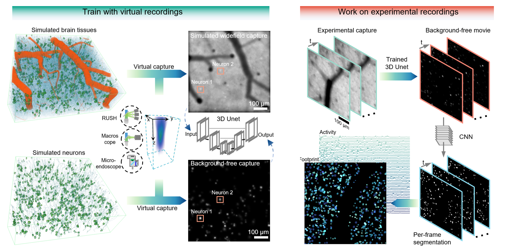

# Deep widefield neuron finder (DeepWonder)

Implementation for deep widefield neuron finder (DeepWonder)

    

## 📋 Table of content
 1. [Overview](#Overview)
 2. [Quick start DeepWonder](#Start)
    1. [Environment](#Environment)
    2. [Install dependencies](#Dependencies)
    3. [Download the demo code and data](#Download)
    4. [Run the trained model](#Run)
    5. [Work for your own data](#Owndata)
    6. [Run Demo data with Google Colab](#Colab)
 3. [Train DeepWonder](#Train)
    1. [Realistic widefield capture generation](#NAOMI)
    2. [Background removal network training](#TrainBR)
    3. [Neuron segmentation network training](#TrainNS)
 4. [Other information](#Information)
    1. [Citation](#Citation)
    2. [Email](#Email)

## **📚** Overview <a name="Overview"></a>
Widefield imaging provides optical access to multi-millimeter fields of view in video rate, but cell-resolved calcium imaging has mostly been contaminated by tissue scattering and calcium inference suffers multiple times slower processing speed than two-photon microscope in the same scale. We present a deep widefield neuron finder (DeepWonder), which is fueled by numerical recordings but effectively works on experimental data with an order of magnitude of speed improvement and improved precision and accuracy. With DeepWonder, widefield calcium recordings can be quickly converted into background-free movies, and neuronal segments and activities then be demixed out. For more details and results, please see our companion paper titled "Deep widefield neuron finder driven by virtual biological data".



## **⏳** Quick start DeepWonder <a name="Start"></a>
This tutorial will show how DeepWonder removes backgrounds in  widefield captures and further segments neurons.
### **💡** Environment <a name="Environment"></a>
* Ubuntu 16.04 
* Python 3.6
* Pytorch >= 1.3.1
* NVIDIA GPU (24 GB Memory) + CUDA

### **💡** Install dependencies <a name="Dependencies"></a>
* Create a virtual environment and install some dependencies.
```
$ conda create -n deepwonder_env python=3.6
$ source activate deepwonder_env
$ pip install -q torch==1.10.0
$ pip install -q torchvision==0.8.2
$ pip install DWonder
$ pip install -q opencv-python==4.1.2.30
$ pip install -q tifffile  
$ pip install -q scikit-image==0.17.2
$ pip install -q scikit-learn==0.24.1
```
### **💡** Download the demo code and data <a name="Download"></a>
```
$ git clone git://github.com/cabooster/Deep_widefield_cal_inferece
$ cd DeepCAD/DeepWonder/
```
We upload three demo data on Google drive: [synthetic widefield data by NAOMi1p code ](https://drive.google.com/drive/folders/1WiTrL5gRuMUssMYt2uDRDO-5pmmrdNSc?usp=sharing), [cropped RUSH data](https://drive.google.com/drive/folders/1CP6CuAmOkAx_hoAhT4h-Pd1o_FTcva9M?usp=sharing) and [widefield data jointly with two-photon ground truth](https://drive.google.com/drive/folders/1QSqbNWmZTlbctYt0Vh0I529gt-kYNX4w?usp=sharing). To run the demo script, those data need to be downloaded and put into the *DeepWonder/datasets* folder. We upload a trained [background removing model](https://drive.google.com/drive/folders/1K3O1TQAOqAwwiwblF2YS90kFNAqnULwK?usp=sharing) and a train [neuron segmentation model](https://drive.google.com/drive/folders/1xmKZV346RgRKcyXp2HuiUTCrRVPjaoCV?usp=sharing). And you can get the background removing results of these three demo data on Google drive: [synthetic widefield data by NAOMi1p code ](https://drive.google.com/drive/folders/1T7vaOT4tThMumCxi_sFeN5vybv91pl2f?usp=sharing), [cropped RUSH data](https://drive.google.com/drive/folders/1XOxiRl1Y2kQt7aWhTat6YC7jQ8s6F5Fv?usp=sharing) and [widefield data jointly with two-photon ground truth](https://drive.google.com/drive/folders/1QourbScvRtLilvNvAYp7-wfJxmX8_er9?usp=sharing). Especially, We upload the [two-photon reference data](https://drive.google.com/drive/folders/1-e9lUnE6n1fCYPMPnMIEjW6YwCd3vm6A?usp=sharing) for widefield demo data.

(5/30/2022) We further upload over 50Gb paired hybrid data on Google drive (https://drive.google.com/drive/folders/1OBcQUY-vsIPljSBChFfn-zqAYtYvDZ4A?usp=sharing),including:

    •	Data that are captured across brain wide (widefield + NA 0.27 2p). 

    •	Data that are distributed in different cortical depths (widefield + NA 0.27 2p). 

    •	High-NA validation data that are captured in multiple cortical regions (widefield + NA 0.60 2p).


### **💡** Run the trained model <a name="Run"></a>
Run the script.py to analyze the demo data. 
```
$ python script.py 
```
The output from the demo script can be found in the *DeepWonder/results* folder. For example, the background removed movie is in the *DeepWonder/results/XXXX/RMBG* folder, the neuron footprint masks are in the *DeepWonder/results/XXXX/f_con* folder and stored in a *.tif* file, and the activities are in the *DeepWonder/results/XXXX/mat*  folder as a *.mat* file.
### **💡** Work for your own data <a name="Owndata"></a>
Since the uploaded pretrained DeepWonder was trained on the synthetic data from NAOMi1p (see following instructions) under RUSH modalities (the specific parameters are in NAOMi1p\config\RUSH_ai148d_config.m) which might be different from your acquisition specifications, it is highly recommended to follow the re-train instructions down below to get the best performances. As an alternative option, new data can be resized into *0.8 um* pixel size to mimic the modality in the pretrained situation and put in the *DeepWonder/datasets* folder. After that,  DeepWonder is ready to go as suggested previously.

### **💡** Run Demo data with Google Colab <a name="Colab"></a>
We have stored our data in Google Colab, which is a free Jupyter notebook environment that requires no setup and runs entirely in the cloud. A demo notebook with full processing of DeepWonder on several demo datasets (including NAOMi1p virtual datasets, cropped RUSH datasets, and two-photon validation datasets, all mounted to the Google Colab using Google Drive) is available through Colab via 
[](https://colab.research.google.com/drive/15TvsyEYgE1iGpaNWkq3flXOw52I51mVa).
By copying that notebook to your online server (like Colab), you can also process linked data in the online fashion.

## **🔁** Train DeepWonder <a name="Train"></a>

### **💡** Realistic widefield capture generation <a name="NAOMI"></a>
DeepWonder relies on a highly realistic simulation of widefield capture for training a network that removes widefield background. We referred to the Neural Anatomy and Optical Microscopy (NAOMi) package (https://www.sciencedirect.com/science/article/pii/S0165027021001084) to populate the brain tissue with multiple blood vessels, somata, axons, and dendrites. We further modified the NAOMi pipeline such that it could faithfully simulate data acquisition of one-photon excitations with one-photon excitation model and related noise model, which we termed as NAOMi1p. The virtual widefield data by NAOMi1p can be affected by optical parameters, illumination powers, and other parameters like protein concentration. The full key parameters are listed as
1. Optical parameters of the microscope: NA, FOV, FN, immersion medium
2. Indicator parameters: expression level, indicator types (e.g. GCaMP6 or GCaMP7)
3. Imaging parameters: session length, frame rate, illumination powers, and imaging depth
4. (optional) Vessel dilation parameters: dilation dynamics, amplitude, and anisotropy across the FOV.

All those parameters should be adjusted based on a specific system. As an example, run NAOMi_1p_single.m to generate a 750 x 750 x 1000 frame virtual widefield recording (mov_w_bg.tiff) along with a background free pair (mov_wo_bg.tiff). To generate multiple training pairs, run NAOMi_1p_loop.m which nests a for loop to generate data.


### **💡** Train background removal network <a name="TrainBR"></a>
Put the backaground removed movie generated by NAOMI1p to the *DeepWonder/datasets/XXXX/GT* folder, and the paired background contaminated movie to the *DeepWonder/datasets/XXXX/Input* folder. After preparing the data, run the script_train_RMBG.py to train the background removal network.
```
$ source activate deepwonder_env
$ python script_train_RMBG.py train
```
The trained removing background model will show up in *DeepWonder/RMBG_pth* folder.

### **💡** Train neuron segmentation network <a name="TrainNS"></a>
Put the backagrond removed movie generated to the *DeepWonder/datasets/XXXX/image* folder as inputs, and the corresponding segmented masks to the *DeepWonder/datasets/XXXX/mask* folder as labels. A good option to get the mask data is to binarize simulated neurons for each of frames (individual neurons are in the vol_out structure from NAOMi1p output). Alternatively, running other two-photon segmentation tools (like CaImAn https://github.com/flatironinstitute/CaImAn) to get segments can also work but probably with performance dropping. Run the script_train_SEG.py to train the neuron segmentation network.
```
$ source activate deepwonder_env
$ python script_train_SEG.py train
```
The trained neuron segmentation model will show up in *DeepWonder/SEG_pth* folder.
 
## 🤝 Other information <a name="Information"></a>
### **📝** Citation <a name="Citation"></a>

   
### **📝** Email <a name="Email"></a>
We are pleased to address any questions regarding the above tools through emails (zhanggx19@mails.tsinghua.edu.cn or ylzhang16@mails.tsinghua.edu.cn).
